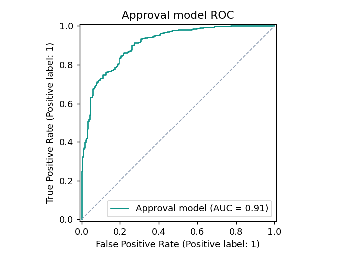
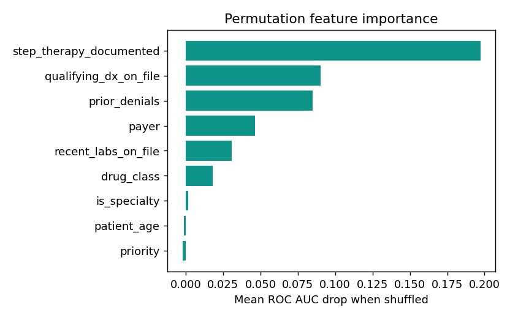
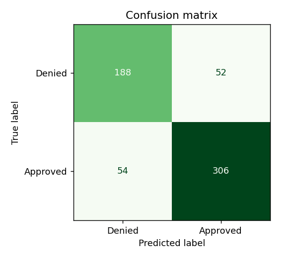

# AuthFlow

**Prior authorization, prepared at the point of care.**

AuthFlow is a prior authorization (PA) automation platform for clinical practices. It detects whether a medication needs a prior authorization the moment it is ordered, auto assembles the payer's required documentation from the patient's chart while the patient is still in the visit, drafts a Letter of Medical Necessity for clinician review, and tracks the request through to a decision. The goal is simple: turn a process that normally takes days into one that takes minutes, by capturing everything the payer needs before the patient ever leaves the room.

> Demonstration prototype. Not a clinical or regulated medical device, not HIPAA covered, and built entirely on synthetic data. See the Compliance section below.

---

## Screenshots

> Placeholders. Capture these from a seeded local run (`/`, `/worklist`, `/pa/[id]`, `/new`, `/analytics`, `/payers`) in both light and dark mode.

| Dashboard | Request detail |
| --- | --- |
| `docs/screenshots/dashboard.png` | `docs/screenshots/pa-detail.png` |

| Point of care intake | Worklist |
| --- | --- |
| `docs/screenshots/intake.png` | `docs/screenshots/worklist.png` |

---

## The problem

In real clinical practice, prior authorizations are usually started after the patient has already left the appointment. By then the clinician can no longer easily capture what the payer requires (recent labs, exam findings, prior therapies tried), so the request stalls and the patient waits days or weeks for their medication.

## The solution

AuthFlow moves the work to the point of care. The instant a drug and plan are selected, it runs the payer's coverage rules, tells the clinician exactly what is required and why, and pulls everything available straight from the chart. What is missing is flagged clearly while it can still be captured. Submission then becomes a single confident step.

---

## Architecture: the Da Vinci CRD, DTR, PAS workflow

AuthFlow is modeled on the HL7 FHIR Da Vinci electronic prior authorization standards. The three stages are first class in both the code and the UI.

- **CRD (Coverage Requirements Discovery).** At the moment a drug or service is ordered, determine whether a PA is required for that patient's specific plan, and why. This runs live on the intake screen (`/new`).
- **DTR (Documentation Templates and Rules).** Pull the payer's required documentation list and auto populate it from the patient's chart, clearly flagging what is still missing. This is the "Auto-fill from chart" action and the documentation checklist on the request detail screen.
- **PAS (Prior Authorization Support).** Submit the completed request and track the decision through to approval, denial, or appeal.

The payer and EHR sides are simulated with realistic synthetic data and deterministic, rule driven responses, because live integration requires HIPAA covered credentials. The data flow and UI nonetheless behave like the real thing.

### How it is built

- **Next.js 14 (App Router) + TypeScript** with `strict` enabled.
- **Tailwind CSS v3 + shadcn/ui** for the design system, with a token system defined in `tailwind.config.ts` and CSS variables.
- **Prisma + SQLite** for local development, with a provider swappable schema (no SQLite only types are used, so the same schema runs on Postgres).
- **Recharts** for charts, **date-fns** for date math, **@faker-js/faker** (fixed seed) for synthetic data.
- **@anthropic-ai/sdk** for the AI Letter of Medical Necessity, called server side only.
- A pure, dependency free **rules engine** in `lib/rules` (no database or React imports) covers CRD necessity, DTR document assembly, and the deterministic PAS decision.
- **Reads** go through a thin data access layer in `lib/data/*` (React Server Components call Prisma directly). **Mutations** are Next.js Server Actions in `lib/actions/*` that call `revalidatePath`. The single exception is the streaming AI route handler.
- An **LLM-as-judge evaluation harness** (`lib/eval` + `eval/run.ts`) scores every generated letter against an eight-criterion rubric, with an optional Claude judge and an aggregate report.
- **Observability and hardening** on the AI route: every generation is logged (model, latency, token usage, fallback flag, status) to a `GenerationLog` table and surfaced on the Analytics screen, behind per-IP rate limiting and a daily spend cap that both degrade gracefully to the template.
- **52 automated tests** (vitest) over the rules engine, eval rubric, deadline logic, parsing, and formatting, plus a **GitHub Actions** workflow that seeds, tests, builds, runs the eval, and runs the Python data-quality gate on every push.
- A **Python data layer** (`analytics/`) reads the same SQLite database with pandas to run an analytics pipeline, a Great Expectations style data-quality gate, and a scikit-learn approval-likelihood model (about 0.91 ROC AUC).

---

## Getting started

Requires Node 20 or newer.

```bash
# 1. Install dependencies
npm install

# 2. Create the local SQLite database from the Prisma schema
npm run db:push

# 3. Seed synthetic data (idempotent, runnable repeatedly)
npm run db:seed

# 4. Run the dev server
npm run dev
```

Then open http://localhost:3000.

To reset and reseed at any time:

```bash
npm run db:reset
```

To run the tests, a production build, and the letter eval harness:

```bash
npm test         # 52 unit tests: rules engine, eval rubric, deadline, parsing, formatting
npm run build    # type-check and production build
npm run eval     # score every generated letter against the rubric
```

### Environment

Copy `.env.example` to `.env`. The only required value is `DATABASE_URL` (already set for local SQLite).

```
DATABASE_URL="file:./dev.db"
ANTHROPIC_API_KEY=
ANTHROPIC_MODEL=claude-opus-4-8
```

---

## AI Documentation Assistant

The Letter of Medical Necessity is drafted by an AI assistant on the request detail screen. It is called only from a server side route handler (`app/api/loms/route.ts`), which streams the letter token by token into an editable field.

- **No API key required to run or demo.** If `ANTHROPIC_API_KEY` is absent (or the model call fails), the route returns a deterministic, well formatted templated draft built from the structured chart data. Anyone who clones the repo gets a working feature out of the box.
- **With a key**, set `ANTHROPIC_API_KEY` and optionally `ANTHROPIC_MODEL` (defaults to `claude-opus-4-8`). The model writes the letter from the structured diagnosis, prior therapies, labs, and payer criteria.
- **The letter is always a draft for clinician review.** It is shown as a draft, must be saved by an explicit action, and is never submitted automatically.

---

## Evaluation harness

`npm run eval` scores the Letter of Medical Necessity generator against an eight-criterion rubric (`lib/eval/rubric.ts`): addressed to the payer, cites the diagnosis, names the therapy, references prior therapy, ties to plan criteria, includes the clinician-review disclaimer, stays within a sensible length, and uses no em or en dashes. It runs over every seeded request, prints a per-criterion pass-rate summary, and writes a JSON report to `eval/reports/latest.json`. With an API key set, an optional Claude LLM-as-judge pass adds a 1 to 5 clinical-quality score over a sample. It is reproducible with no key because it scores the deterministic template, and it runs as a gate in CI.

## Observability

Every letter generation is recorded in a `GenerationLog` row capturing the model, latency, token usage, whether it fell back to the template, and the outcome (ok, error, rate limited, or spend capped). The Analytics screen surfaces this as live telemetry: generation count, average latency, fallback rate, total output tokens, and a status breakdown. The AI route is guarded by per-IP rate limiting and a daily spend cap, both of which degrade gracefully to the template rather than failing the request.

## Python data layer

`analytics/` is a Python (pandas) layer over the same SQLite database the app uses. `data_quality.py` runs Great Expectations / Pydeequ style expectations (enum domains, uniqueness, completeness, decision integrity, temporal ordering, referential integrity, JSON validity) and exits non-zero on a critical failure, so it gates CI. `pa_analytics.py` computes the practice metrics as a data-engineering artifact and writes JSON and Markdown reports. See `analytics/README.md`.

```bash
python -m pip install -r analytics/requirements.txt
python analytics/data_quality.py      # data-quality gate
python analytics/pa_analytics.py      # writes analytics/output/report.{json,md}
python analytics/approval_model.py    # trains the model, writes figures + metrics
```

### Approval-likelihood model

`approval_model.py` trains a gradient-boosted classifier (scikit-learn `HistGradientBoostingClassifier`) to predict whether a request will be approved from its features. It reads the real drug-class and payer vocabulary from the database so the model speaks the app's domain, then learns an interpretable signal: documentation completeness drives approval up, while prior denials and stricter payers pull it down. On a held-out split it reaches about **0.91 ROC AUC** and **82% accuracy** over a 60% approval base rate. Permutation importance (the honest, model-agnostic kind) ranks step-therapy documentation, qualifying diagnosis, and prior denials as the top drivers, which is exactly what the rules engine rewards.

| ROC curve | Permutation importance | Confusion matrix |
| --- | --- | --- |
|  |  |  |

The approval label is generated from a realistic latent function rather than the demo's recorded decisions, because those are payer discretion and carry little learnable signal on their own. The pipeline, metrics, and figures are fully reproducible from the fixed seed and run as a step in CI.

---

## Deployment

SQLite is ideal for local development but does not persist on a serverless filesystem, so a Vercel deploy backed by SQLite would lose its data. Two supported paths:

### Path A: a host with a persistent disk (simplest)

Deploy on Railway, Render, or Fly.io and keep SQLite. Set `DATABASE_URL="file:./dev.db"`, run `npm run db:push && npm run db:seed` as part of the release, and the demo starts populated.

### Path B: Vercel + hosted Postgres

The Prisma schema is provider swappable. Point `DATABASE_URL` at a hosted Postgres (Neon or Supabase), change the `datasource` provider in `prisma/schema.prisma` to `postgresql`, then run `prisma db push` and `npm run db:seed` against it (a guarded build time seed keeps the live demo populated). Keep all secrets in the host's environment variables. Never commit `.env` or the SQLite file.

---

## Production roadmap

This prototype simulates the payer and EHR sides. In production, the same architecture slots onto live data:

1. **EHR via HL7 FHIR.** Replace the synthetic chart with FHIR reads of the patient's diagnoses (`Condition`), prior therapies (`MedicationRequest` history), and labs (`Observation`). The rules engine already consumes a structured chart shape, so only the data access layer changes.
2. **Da Vinci CRD.** Call the payer's CRD service at order time instead of evaluating local `PayerRule` rows, returning the same required or not required decision and reasons.
3. **Da Vinci DTR.** Render the payer's real DTR questionnaire and prepopulate it from the FHIR chart, replacing the local document templates.
4. **Da Vinci PAS.** Submit through a payer or clearinghouse PAS endpoint (X12 278 or FHIR PAS) and subscribe to status updates, replacing the simulated decision.
5. **Identity, audit, and compliance.** Add real authentication and role based access, a full audit trail, and a HIPAA covered hosting and BAA posture before any real PHI is handled.

The rules engine, the status and timeline model, and the documentation checklist are all designed to survive that transition unchanged.

---

## Compliance and responsibility

AuthFlow is a demonstration prototype. It is not a clinical or regulated medical device, it is not HIPAA covered, and it uses only synthetic data. It never includes or requests real protected health information. AI generated clinical text is always a draft for clinician review and is never submitted without an explicit human step. This notice is repeated in a persistent footer throughout the app.
